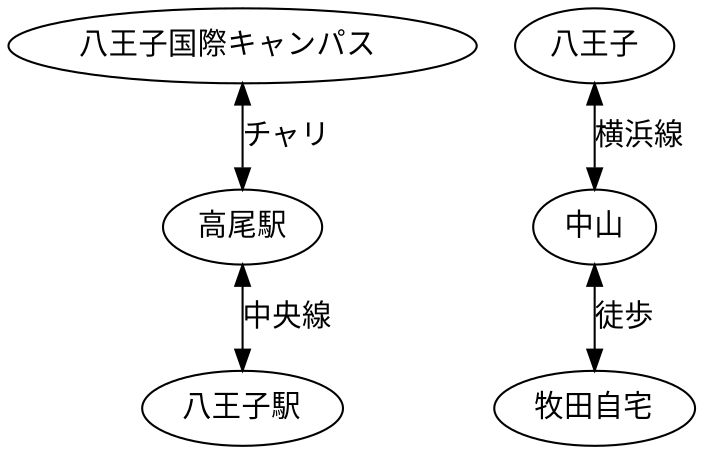

# 牧田の通学経路

[メンバー表に戻る](member.md#メンバー表)

```graphviz
digraph {
    edge [dir=both]

    八王子国際キャンパス　-> 高尾駅 [label=チャリ]
    高尾駅 -> 八王子駅 [label=中央線]
    八王子 -> 中山 [label=横浜線]
    中山 -> 牧田自宅 [label=徒歩]

}
```
