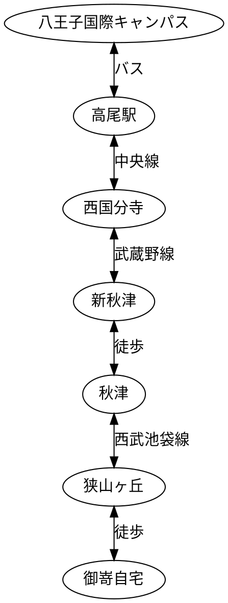

# 御嵜の通学経路

[メンバー表に戻る](member.md#メンバー表)

```graphviz
digraph {
    edge [dir=both]

   八王子国際キャンパス -> 高尾駅 [label=バス]
   高尾駅 -> 西国分寺 [label=中央線]
   西国分寺 -> 新秋津 [label=武蔵野線]
   新秋津 -> 秋津 [label=徒歩]
   秋津 -> 狭山ヶ丘 [label=西武池袋線]
   狭山ヶ丘 -> 御嵜自宅 [label=徒歩]
}
```
